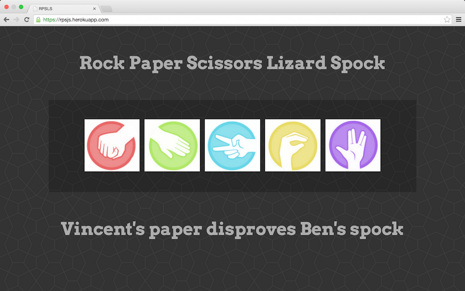

Rock Paper Scissors
======================================

@ Makers Academy
----------------




An one page rock paper scissors built with Jquery, Javascript and a sinatra backend. Served as a introduction to 
OOP and TTD in javascript

[Click here](https://bens-rps.herokuapp.com/) to check it out on heroku

Skills learnt/used
-----------------
> * Javascript 
> * Jquery
> * Jasmine 
> * ruby
> * sinatra
> * Html5
> * CSS3


How to use
----------

Clone the repository:

```shell 
$ git clone git@github.com:benjamintillett/rock_paper_scissors_js.git

```

run SpecRunner to view the tests:

```shell 
$ cd rock_paper_scissors_js
$ open SpecRunner.html
```

Start the server:

```shell 
$ rackup
```

Point your browser to http://localhost:4567/ to play!.

